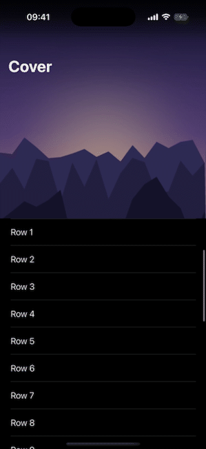

# TableViewControllerCoverKit


A UIKit `UITableViewController` whose list scrolls over a cover image: the image sits behind the rows with a once‑rendered vignette, springs on overscroll, and the navigation bar fades in as the list rises over it. Subclass it and hand it an image — the list itself stays a plain `UITableViewController`.

## Features

- 🖼️ Cover image behind the list, with the vignette rendered once (not per frame)
- 🌫️ Navigation bar fades in as the list scrolls up over the cover
- ☀️ Status bar reads light while the bar floats over the image
- ↕️ Spring stretch when the cover is pulled down
- 🔠 Works with standard or large titles
- 📦 Pure UIKit · no dependencies · iOS 15+
- ↩️ Drop‑in: remove the package and swap the superclass back to `UITableViewController` for a plain list

## Demo

<table>
  <tr>
    <td align="center"><b>Default (standard title)</b></td>
    <td align="center"><b>Large titles</b></td>
  </tr>
  <tr>
    <td></td>
    <td></td>
  </tr>
</table>

## Requirements

- iOS 15+
- Swift 5.9+

## Installation

Add the package in Xcode (**File ▸ Add Package Dependencies…**) or to your `Package.swift`:

```swift
.package(url: "https://github.com/A-bv/TableViewControllerCoverKit", from: "5.0.0")
```

## Usage

Subclass `CoverImageTableViewController`, give it a cover image, and **present it inside a `UINavigationController`** — the bar fade and the light status bar over the cover rely on having a navigation bar:

```swift
import TableViewControllerCoverKit

final class MyListViewController: CoverImageTableViewController {
    override func viewDidLoad() {
        super.viewDidLoad()
        title = "Cover"
        setCoverImage(UIImage(named: "cover"))
    }
}

// somewhere in your scene/app setup:
window.rootViewController = UINavigationController(rootViewController: MyListViewController())
```

The base class owns the cover: the vignette, the spring stretch on overscroll, and the bar that fades in as the list scrolls up over the image while the status bar reads light over the cover.

## Populating the list

`CoverImageTableViewController` only adds the cover — the list is still an ordinary `UITableViewController`, so you drive it with the normal data source. Register a cell and override the usual methods:

```swift
final class MyListViewController: CoverImageTableViewController {
    private let items = ["One", "Two", "Three"]

    override func viewDidLoad() {
        super.viewDidLoad()
        title = "Cover"
        tableView.register(UITableViewCell.self, forCellReuseIdentifier: "cell")
        setCoverImage(UIImage(named: "cover"))
    }

    override func tableView(_ tableView: UITableView, numberOfRowsInSection section: Int) -> Int {
        items.count
    }

    override func tableView(_ tableView: UITableView, cellForRowAt indexPath: IndexPath) -> UITableViewCell {
        let cell = tableView.dequeueReusableCell(withIdentifier: "cell", for: indexPath)
        var config = cell.defaultContentConfiguration()
        config.text = items[indexPath.row]
        cell.contentConfiguration = config
        return cell
    }
}
```

Custom cells, diffable data sources, and `UITableViewDelegate` callbacks all work exactly as they do on a plain `UITableViewController`.

## Large titles

The bar defaults to a standard title and works the same on every device. Large titles are supported too — opt in as usual:

```swift
navigationController?.navigationBar.prefersLargeTitles = true
```

With large titles the bar fades in step with the title collapsing into its inline position — the same coupling the system uses — which naturally lands a little earlier in the scroll than the standard-title fade.

## Customization

| Property | Default | Effect |
| --- | --- | --- |
| `coverCornerRadius` | `22` | Corner radius where the list meets the image. |
| `expandedBarHeight` | `nil` (derived) | Optional override for the bar area above the content; derived from the safe area when `nil`. |
| `barBackgroundColor` | `.systemBackground` | The bar's background once it has fully faded in. |
| `suspendsCoverStatusBarStyle` | `false` | Set while presenting a modal so the status bar reads normally. |

## Notes

- **Portrait-oriented.** The cover is half the view height, designed for a portrait phone screen; it isn't tuned for landscape or iPad multitasking.
- **Overscroll is the cover's.** The pull-down spring drives the cover stretch, so adding a `UIRefreshControl` will conflict with it.

## Preview

A scrollable `#Preview` ships with the package — open `Previews.swift` in Xcode to see the fade and stretch without building an app.

## License

TableViewControllerCoverKit is available under the MIT License. See [LICENSE](LICENSE).
