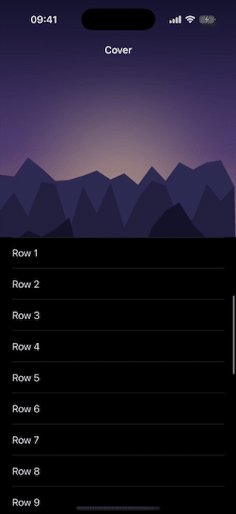

# TableViewControllerCoverKit

[](https://github.com/A-bv/TableViewControllerCoverKit/actions/workflows/ci.yml)


A `UITableViewController` subclass that renders your table list over a cover image with a gorgeous fade effect, navigation bar that transitions in, and a spring stretch on overscroll.

<p align="center">
  
</p>

## Requirements

- iOS 15+
- UIKit
- The controller must be embedded in a `UINavigationController` for the bar fade and status-bar transitions to work.

## Installation

### Swift Package Manager

Add this package in Xcode: **File → Add Packages** and enter:
```
https://github.com/A-bv/TableViewControllerCoverKit
```

Or add this to your `Package.swift`:

```swift
.package(url: "https://github.com/A-bv/TableViewControllerCoverKit", from: "7.1.0")
```

## Quick Start

Subclass `CoverImageTableViewController`, present it in a `UINavigationController`, set your cover image, and implement the standard table view data source methods:

```swift
import TableViewControllerCoverKit

final class MyList: CoverImageTableViewController {
    private let items = ["One", "Two", "Three"]

    override func viewDidLoad() {
        super.viewDidLoad()
        tableView.register(UITableViewCell.self, forCellReuseIdentifier: "cell")
        if let cover = UIImage(named: "cover") { setCoverImage(cover) }
    }

    override func tableView(_ tableView: UITableView, numberOfRowsInSection section: Int) -> Int {
        items.count
    }

    override func tableView(_ tableView: UITableView, cellForRowAt indexPath: IndexPath) -> UITableViewCell {
        let cell = tableView.dequeueReusableCell(withIdentifier: "cell", for: indexPath)
        cell.textLabel?.text = items[indexPath.row]
        return cell
    }
}
```

## API

Everything is on `CoverImageTableViewController`:

| Member | Description |
| --- | --- |
| `setCoverImage(_ image: UIImage)` | Sets (or replaces) the cover image. Resizing and the vignette run off the main thread; the image is assigned once ready. |
| `barBackgroundColor: UIColor` | Colour the navigation bar fades to as the list scrolls up past the cover. Defaults to `.systemBackground`. |
| `expandedBarHeight: CGFloat?` | Override for the resting top inset. When `nil` (default) it's derived from the safe area. |
| `coverStatusBarStyle: UIStatusBarStyle` | Status bar style (and bar foreground colour) while resting over the cover. Defaults to `.lightContent`; use `.darkContent` for light covers. |
| `suspendsCoverStatusBarStyle: Bool` | When `true`, forces the default status bar style instead of `coverStatusBarStyle`. Defaults to `false`. |

## Subclassing

`CoverImageTableViewController` drives its effects from `viewWillAppear`,
`viewWillDisappear`, `viewDidLayoutSubviews`, and `scrollViewDidScroll`. If you
override any of them in your subclass, call `super` — otherwise the bar fade,
cover stretch, or inset positioning will stop working.

## Development

The package is iOS-only (UIKit). `swift build` / `swift test` target macOS and fail with *"no such module 'UIKit'"* — run the tests on an iOS simulator instead. Pick any simulator installed on your machine (list them with `xcrun simctl list devices available`):

```sh
xcodebuild test -scheme TableViewControllerCoverKit \
  -destination 'platform=iOS Simulator,name=iPhone 17'
```

## License

MIT
