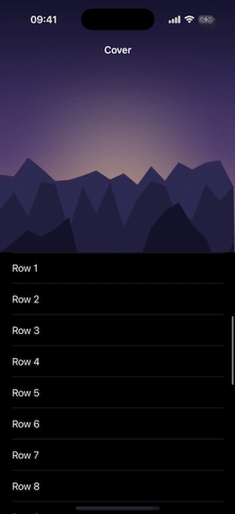

# TableViewControllerCoverKit

Cover art that scrolls like the Music app. A `UITableViewController` that shows a cover image behind your list: as you scroll up, the navigation bar fades to a solid colour and the status bar returns to normal; pull down and the image stretches with a spring (see the gif below).

[](https://github.com/A-bv/TableViewControllerCoverKit/actions/workflows/ci.yml)


[](LICENSE)

It is a drop-in subclass with no dependencies: set a cover image, fill the table as usual, and the fade, the status-bar transition, and the overscroll stretch are handled for you.

<p align="center">
  
</p>

## Install

Swift Package Manager. In Xcode, **File ▸ Add Package Dependencies…** and paste the URL:

```
https://github.com/A-bv/TableViewControllerCoverKit
```

or declare it in `Package.swift`:

```swift
.package(url: "https://github.com/A-bv/TableViewControllerCoverKit", from: "7.1.0")
```

## Usage

Subclass `CoverImageTableViewController`, give it a cover image, and fill the table like any table view controller:

```swift
import UIKit
import TableViewControllerCoverKit

final class AlbumViewController: CoverImageTableViewController {
    private let tracks = ["Intro", "Nightcall", "A Real Hero", "Outro"]

    override func viewDidLoad() {
        super.viewDidLoad()
        tableView.register(UITableViewCell.self, forCellReuseIdentifier: "cell")

        setCoverImage(UIImage(named: "album-art")!)   // the image behind the list

        // Optional. All four have sensible defaults:
        barBackgroundColor = .systemBackground        // colour the bar fades to past the cover
        coverStatusBarStyle = .lightContent           // bar text over the cover; .darkContent for light images
        expandedBarHeight = nil                       // resting space for the bar (nil = from the safe area)
        suspendsCoverStatusBarStyle = false           // true keeps the system status bar over the cover
    }

    override func tableView(_ tableView: UITableView, numberOfRowsInSection section: Int) -> Int {
        tracks.count
    }

    override func tableView(_ tableView: UITableView, cellForRowAt indexPath: IndexPath) -> UITableViewCell {
        let cell = tableView.dequeueReusableCell(withIdentifier: "cell", for: indexPath)
        cell.textLabel?.text = tracks[indexPath.row]
        return cell
    }
}
```

Your controller has to live in a `UINavigationController`, since that is the bar it fades in:

```swift
window.rootViewController = UINavigationController(rootViewController: AlbumViewController())
```

If you override `viewWillAppear`, `viewWillDisappear`, `viewDidLayoutSubviews`, or `scrollViewDidScroll`, call `super`, since the effects run inside them.

## Behavior

- **Large covers never stall scrolling.** The image is scaled to fill and rendered off the main thread.
- **It survives rotation and non-fullscreen scenes** like split view and sheets, re-rendering the cover for the new size.
- **The navigation bar is left clean.** Its tint is restored when the controller disappears, so the cover's colour never bleeds into the next screen.

## Implementation

A single `UITableViewController` subclass with no dependencies. The cover is a table background view; the fade, the status-bar style, and the overscroll stretch are driven from `scrollViewDidScroll` and the layout pass. The status bar is read from the view's own window scene rather than `UIApplication.shared`, so the library works in app extensions. It builds in Swift 6 under complete strict concurrency.

## Layout

```text
Package.swift     ┐
Sources/          │  the library and its Xcode preview
Tests/            ┘

README.md         ┐
LICENSE           ┘  docs, kept at root by convention

.gitignore        the ignore rules

.github/          CI workflow and the demo GIF
```

## License

MIT. See [LICENSE](LICENSE).
